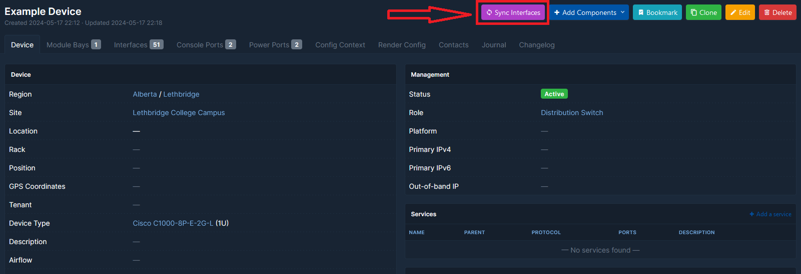
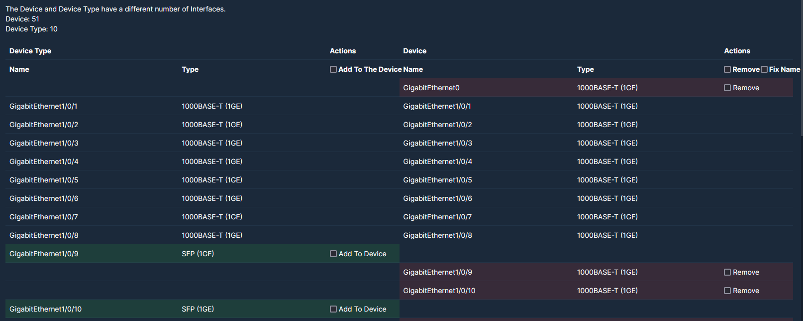

# netbox-interface-synchronization
## Overview
MAJOR UPDATE

Thanks to a massive contribution from bastianleicht the Interface Synchronization plugin has become the Component Synchronization plugin. 

This plugin allows you to compare and synchronize component names and types between devices and device types in NetBox 4+. It can be useful for finding and correcting inconsistencies between components when changing the device type.
## Compatibility
Tested with NetBox versions 4.3.1  This plugin is not compatible with Netbox 2 or 3

## Installation
If your NetBox 4 installation uses virtualenv, activate it like this:
```
source /opt/netbox/venv/bin/activate
```
Install the plugin from PyPI:
```
pip install netbox-interface-synchronization
```
or clone this repository, then go to the folder with it and install the plugin:
```
pip install .
```
To enable to plugin, add the plugin's name to the `PLUGINS` list in `configuration.py` (it's usually located in `/opt/netbox/netbox/netbox/`) like so:
```
PLUGINS = [
    'netbox_component_synchronization'
]
```
Don't forget to restart NetBox:
```
sudo systemctl restart netbox
```
## Usage
To sync the components, edit the device and set the new device type and save the device. Then find the "Sync Components" button at the bottom of the page:

Mark the required actions with the checkboxes and click "Apply".

### Plugin Settings
If you want to override the default values, configure the `PLUGINS_CONFIG` in your `configuration.py`:
```
PLUGINS_CONFIG = {
    'netbox_component_synchronization': {
        'exclude_interface_type_list': [],
        'enable_auto_discovery': True,
        'exclude_auto_discovery_types': [],
        'compare_description': True
    }
}
```

## Testing and Development

### Automated Testing

This plugin includes comprehensive automated testing and CI/CD workflows:

- **PR Testing**: Automatically tests pull requests against multiple NetBox versions
- **Code Formatting**: Automatically formats code using Black and isort  
- **NetBox Compatibility**: Monitors new NetBox releases and tests compatibility
- **Universal Tests**: Test suite works across different environments

### Running Tests Locally

The plugin includes a universal test runner that works in different environments:

```bash
# Run all tests (auto-detects best method)
python run_tests.py

# Run only validation tests (works without NetBox)
python run_tests.py --test-type validation

# Run with verbose output
python run_tests.py --verbose

# Force specific test runner
python run_tests.py --pytest
python run_tests.py --unittest
```

### Test Categories

1. **Validation Tests**: Basic import and module structure tests (no NetBox required)
2. **Unit Tests**: Component registry, async utilities, and core functionality
3. **Integration Tests**: Full workflow testing with NetBox models

### Continuous Integration

[](https://github.com/0lini/netbox-component-synchronization/actions)
[](https://github.com/0lini/netbox-component-synchronization/actions)

The plugin automatically:
- Tests against NetBox 4.0, 4.1, and latest versions
- Runs code quality checks (Black, isort, flake8)
- Monitors for new NetBox releases and tests compatibility
- Creates PRs for NetBox compatibility updates
| Setting | Default value | Description |
| --- | --- | --- |
| exclude_interface_type_list | `[]` | List of interface types to exclude from comparison |
| enable_auto_discovery | `True` | Enable automatic discovery of component types from NetBox |
| exclude_auto_discovery_types | `[]` | List of component types to exclude from auto-discovery |
| compare_description | `True` | Include description field in component comparison |

### Auto-Discovery Feature
The plugin now automatically discovers available component types from NetBox, eliminating the need to manually add new component types to the synchronization system. This feature:

- **Automatically detects** all component models in NetBox that have corresponding template models
- **Dynamically generates** URL patterns and view classes for each discovered component type
- **Analyzes model fields** to determine which attributes should be synchronized
- **Creates comparison classes** automatically for new component types

When new component types are added to NetBox in future versions, they will automatically become available for synchronization without requiring plugin updates.

#### Debugging Auto-Discovery
You can inspect discovered components using the management command:
```bash
# Show summary of all discovered components
python manage.py inspect_components

# Show detailed information
python manage.py inspect_components --detailed

# Show details for a specific component
python manage.py inspect_components --component interface
```

#### Troubleshooting
If auto-discovery isn't working as expected:

1. **Check configuration**: Ensure `enable_auto_discovery` is `True`
2. **Check exclusions**: Verify the component isn't in `exclude_auto_discovery_types`
3. **Check logs**: Look for warning/error messages in NetBox logs
4. **Use debug utilities**: Import and run debug functions from the plugin

```python
from netbox_component_synchronization.debug_utils import debug_component_discovery
debug_component_discovery()
```
